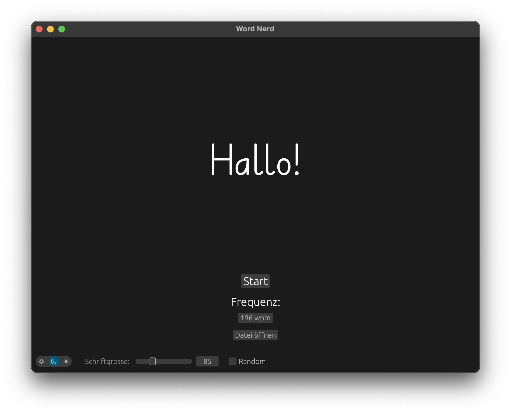

# Word Nerd

A cross-platform speed reader written in rust.  


Word Nerd now features the poem/paragraph mode, where you can load in a larger text file and it will scroll through the
words on one single line! An example is given in `manimatter.txt`.
In the classic mode, the speed is set in words per minute (WPM). In the poem/paragraph mode, the speed is set in
characters per minute (CPM). A classic example is given in `abc.txt`.

Navigate through the words using the space bar (start/stop) and adjust the speed with arrow up/arrow down (normally in increments
of 1 and in increments of 10, if shift is pressed). In manual mode (stopped), you can browse through the words with left and right arrow
keys.

## Font Installation

This project uses the Deutschschweizer Basisschrift font. Due to licensing restrictions, the font file cannot be
included in this repository.

To use the application, please download the font from the official website:

[Die Deutschschweizer Basisschrift](https://www.basisschrift.ch)

After downloading, place the font file (`DCH-Basisschrift.ttf`) in the `fonts/` directory of the project.

The source code can be run using ```cargo run --release``` or bundled to a platform-executable using
```cargo bundle --release```.  
Currently [cargo bundle](https://github.com/burtonageo/cargo-bundle) only supports linux and macOS
bundles [see github issue](https://github.com/burtonageo/cargo-bundle/issues/77).
As a work-around we can use [cargo wix](https://github.com/volks73/cargo-wix) to create a windows installer.

It can be compiled and run on all platforms.
Tested on:

- MacOS 12.4 Monterey x86
- MacOS 15.5 Sequoia ARM
- ...

## Installation

### Download Pre-built Executables

[Binary bundles](https://github.com/hacknus/word-nerd/releases) are available for Linux, macOS, and
Windows.

#### macOS

If you see the message `"Word Nerd is damaged and cannot be opened."` on macOS, run the following command in
the terminal:

```sh
xattr -rd com.apple.quarantine Word\ Nerd.app
```

#### Linux

Install dependencies:

```sh
sudo apt-get install libxcb-render0-dev libxcb-shape0-dev libxcb-xfixes0-dev libxkbcommon-dev libssl-dev libasound2-dev libxkbcommon-x11-0 libx11-dev
```

